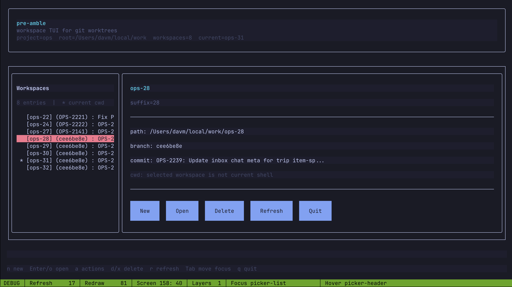

# [pre]amble

`pre`amble is a small workspace helper for git worktrees.

It is designed around a project prefix (default: `project`) and a workspace root (default: `~/local/work`).



## What it does

- List numbered worktrees like `project-08` with their current branch.
- Resolve a suffix (e.g. `pre 08`) to a workspace path.
- Create the next worktree with `pre new` from `origin/main`.
- Create from another base ref with `pre new <branch>` (resolved as `origin/<branch>`).
- Print/install a zsh wrapper so suffix commands can `cd` in your shell.

## Commands

```bash
pre                 # interactive picker in a TTY
pre list
pre 08
pre new
pre new other-branch
pre remove 08 --yes
pre remove 08 --yes --force
pre rm 08 --yes
pre setup
pre setup --install
pre init
```

## Shell integration

The Go binary cannot change the parent shell directory directly.

Use the wrapper installer:

```bash
pre setup --install
source ~/.functions.sh
```

This installs a `pre()` shell wrapper in `~/.functions.sh` so commands like `pre 08` navigate correctly.

## Configuration

Environment variables:

- `PRE_BASE` (default: `$HOME/local/work/project`)

Example:

```bash
export PRE_BASE="${HOME}/local/work/project"
```

## Development

Build and link the binary into `~/go/bin`:

```bash
just bin
```

Run locally:

```bash
go run ./cmd/pre list
```
