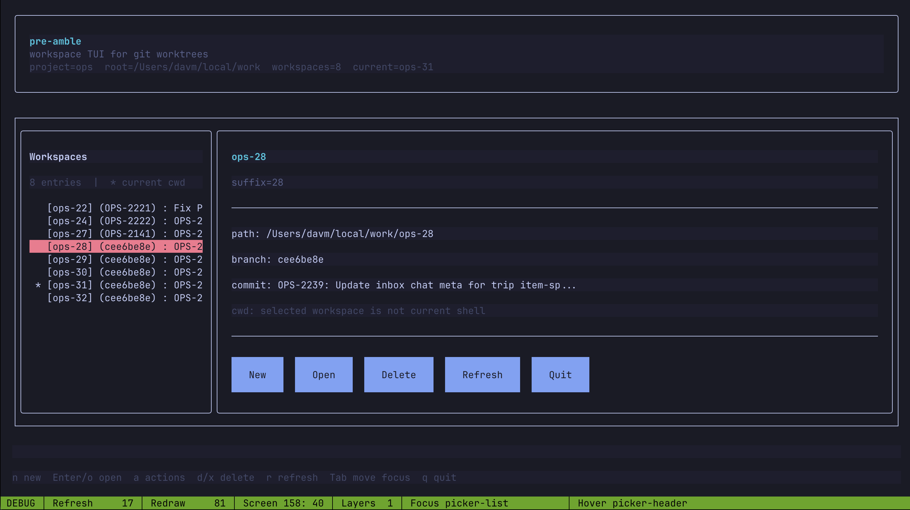

# [pre]amble

`pre`amble is a small workspace helper for git worktrees.

It is designed around a base repository path (default: `~/local/work/project`) and numbered sibling worktrees.



## What it does

- List worktrees like `23 -> OPS-2321` with their current branch.
- Mark worktrees with staged, unstaged, or untracked changes using a leading `/\` marker.
- Resolve a suffix (e.g. `pre 08`) to a workspace path.
- Create the next worktree with `pre new` from `origin/main`.
- Create from another base ref with `pre new <branch>` (resolved as `origin/<branch>`).
- Print/install a zsh wrapper so suffix commands can `cd` in your shell.

## Requirements

- Git
- zsh for automatic directory switching
- Go 1.26.1 or newer when installing from source
- [`just`](https://github.com/casey/just) only for development commands

The expected layout is:

```text
~/local/work/
├── project/       # base Git repository
├── project-01/    # managed worktree
└── project-02/    # managed worktree
```

## Installation

Install the latest source version with Go:

```bash
go install github.com/dviramontes/preamble/cmd/pre@latest
```

Make sure `$(go env GOPATH)/bin` is on your `PATH`.

Tagged versions also provide prebuilt macOS and Linux archives on the
[GitHub Releases](https://github.com/dviramontes/preamble/releases) page.

Enable directory switching in zsh:

```bash
pre setup --install
source ~/.zshrc
```

The installer writes the wrapper to `~/.config/preamble/pre.zsh` and adds an
idempotent source line to `~/.zshrc`.

## Commands

```bash
pre                 # interactive picker in a TTY; list otherwise
pre list
pre version
pre 08
pre new
pre new other-branch
pre remove 08 --yes
pre remove 08 --yes --force
pre rm 08 --yes
pre setup
pre setup --install
pre init
```

## Shell integration

The Go binary cannot change the parent shell directory directly.

To inspect the wrapper without installing it:

```bash
pre setup
```

Run `pre setup --install` to install it so commands like `pre 08` navigate correctly.

## Configuration

Environment variables:

- `PRE_BASE` (default: `$HOME/local/work/project`)
- `PRE_DEFAULT_REF` (default: the remote branch referenced by `origin/HEAD`,
  falling back to `origin/main`)

Example:

```bash
export PRE_BASE="${HOME}/local/work/project"
export PRE_DEFAULT_REF="upstream/trunk"
```

The repository includes an `.env.example` for convenience, but `pre` does not
load dotenv files. Source your own file from your shell configuration if you use
one.

## Development

Run all formatting, vet, test, and build checks:

```bash
just check
```

Build and link the binary into `~/go/bin` for local development:

```bash
just bin
```

Run locally:

```bash
go run ./cmd/pre list
```

## Releasing

Push a semantic-version tag to build macOS and Linux archives and publish a
GitHub release. The release build bakes the tag's version into the binary, which
is displayed by `pre version`:

```bash
git tag v0.1.0
git push origin v0.1.0
```
